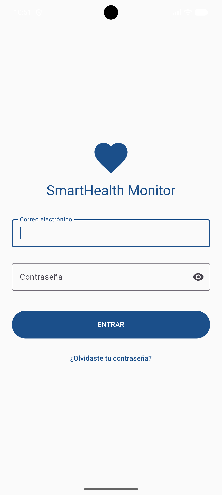
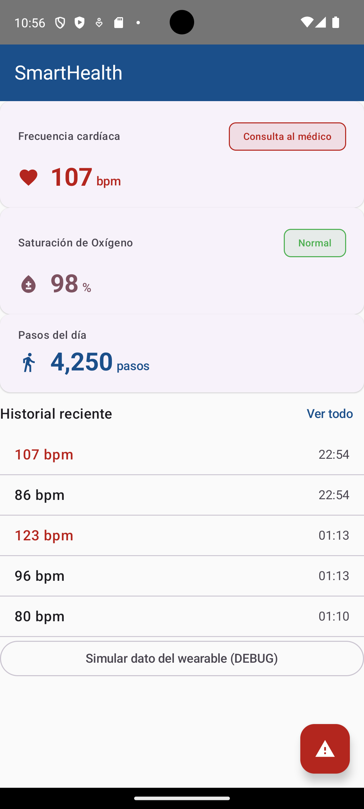

# SmartHealth Monitor
 
Aplicación Android multiplataforma para monitoreo de salud personal.
Desarrollada como proyecto integrador en UTNG — 9° Cuatrimestre 2026.
 
## Stack tecnológico
- Kotlin + Jetpack Compose
- Material Design 3
- Wearable Data Layer API (Wear OS)
- Android TV / Leanback + Media3
- Jetpack Navigation + Room + StateFlow
 
## Pantallas implementadas
- [x] LoginScreen — S4
- [x] DashboardScreen — S5
- [ ] Historial + wereable real — S6
- [ ] Android TV — S10-S12

## Capturas de pantalla

 
## Autor
Zahir Rodríguez — UTNG — zahir.rodriguez@utng.edu.mx
