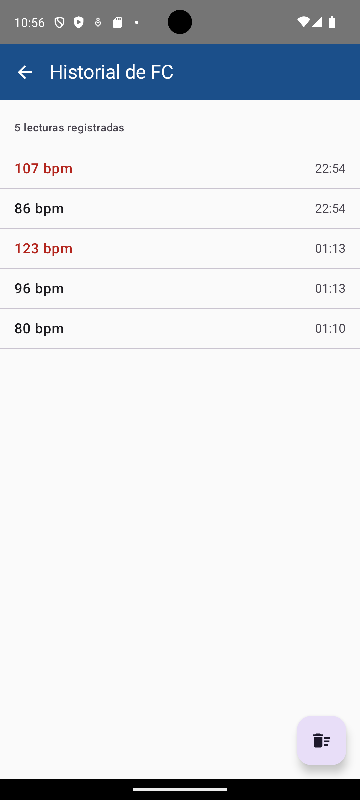
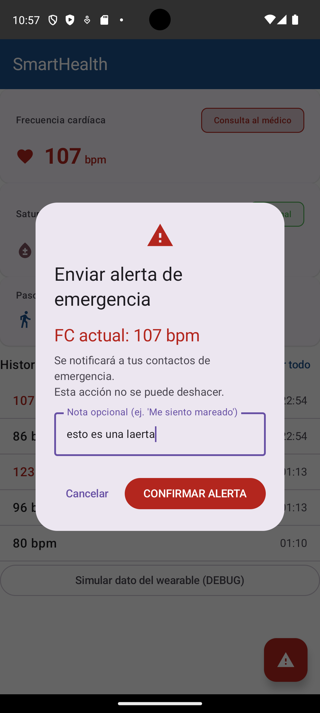
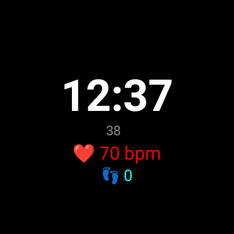
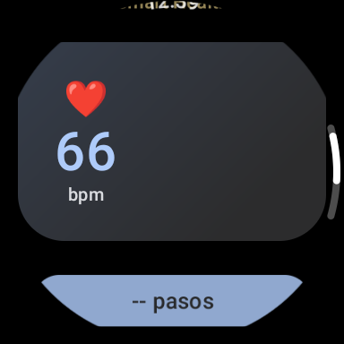
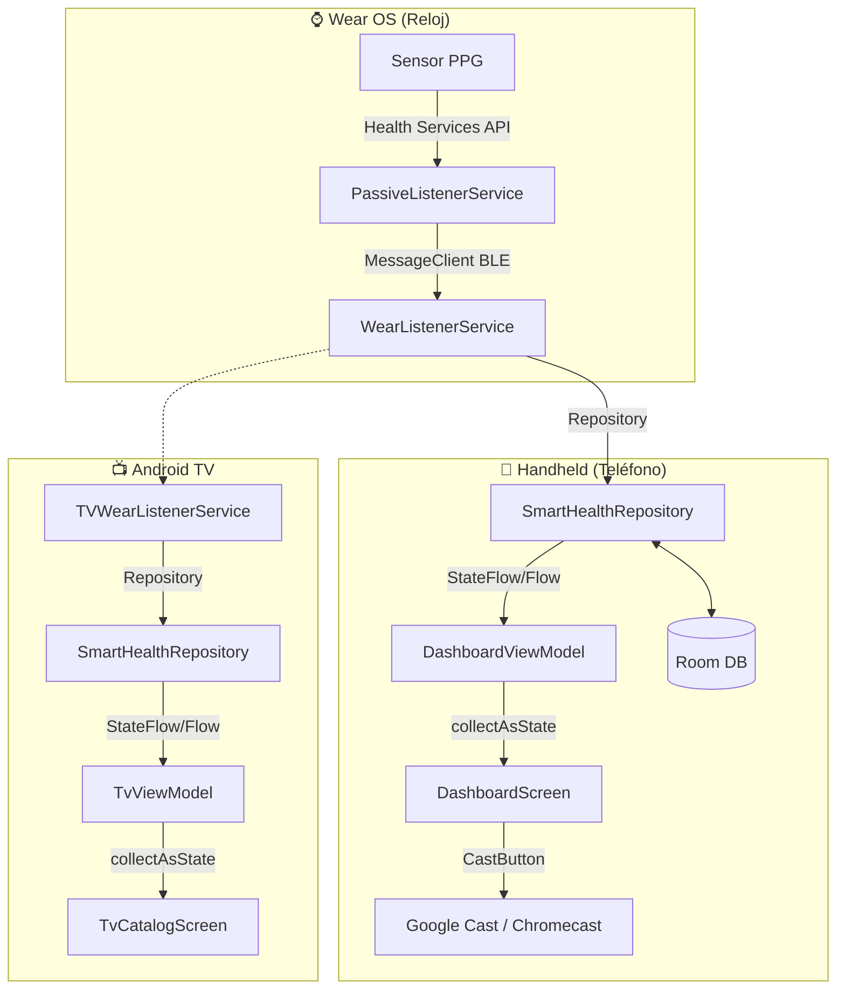

#  SmartHealth Monitor

[](https://developer.android.com/)
[](https://developer.android.com/jetpack/compose)
[](https://kotlinlang.org/)

> [!IMPORTANT]
> **Aplicación Android de monitoreo de salud personal en tiempo real.**
> Desarrollada como proyecto integrador para la **UTNG — 9° Cuatrimestre 2025**.

---

## 🛠️ Stack Tecnológico

| Tecnología | Uso |
| :--- | :--- |
| **Kotlin + Jetpack Compose** | UI declarativa moderna con Material Design 3. |
| **Wearable Data Layer API** | Comunicación bidireccional entre reloj y teléfono (BLE). |
| **Health Services API** | Integración con sensores de FC en segundo plano (Wear OS). |
| **Room Database** | Historial persistente de lecturas de frecuencia cardíaca. |
| **Jetpack Navigation** | Gestión robusta del flujo de navegación entre pantallas. |
| **GitHub + Conventional Commits** | Control de versiones bajo estándares profesionales. |

---

## 📱 Pantallas Implementadas

| Pantalla | Descripción |
| :--- | :--- |
| **LoginScreen** | Autenticación de usuario con validación de estados. |
| **DashboardScreen** | Visualización en tiempo real de FC y pasos desde el wearable. |
| **HistorialScreen** | Listado de lecturas persistidas en Room con Flow reactivo. |
| **AlertaScreen** | Sistema de emergencia con AlertDialog MD3 y Snackbar con acción de deshacer. |

---

## 📸 Capturas de Pantalla

> [!TIP]
> *Aquí se muestran las interfaces principales de la aplicación en dispositivos móviles y Wear OS.*

<div align="center">
  <table>
    <tr>
      <td align="center"><b>Login</b><br/></td>
      <td align="center"><b>Dashboard</b><br/></td>
    </tr>
    <tr>
      <td align="center"><b>Historial</b><br/></td>
      <td align="center"><b>Alerta</b><br/></td>
    </tr>
  </table>
</div>

## Unidad II — Wear OS
| Pantalla | Descripción |
|---|---|
| WearDashboardScreen | FC en tiempo real con ScalingLazyColumn y TimeText |
| WearHistorialScreen | Lista con Rotary Input (corona del reloj) |
| WearAlertaScreen    | Botones circulares de confirmación |
| SmartHealth WatchFace | Hora + FC en el WatchFace nativo |

<div align="center">
  <table>
    <tr>
      <td align="center"><b>WatchFace</b><br/></td>
      <td align="center"><b>Wear Dashboard</b><br/></td>
    </tr>
  </table>
</div>

## 🏗️ Arquitectura — SmartHealth Monitor

La aplicación sigue un flujo de datos reactivo y distribuido entre tres plataformas (Wear OS, Mobile y TV) utilizando la **Wearable Data Layer API** y **Google Cast**.



### Detalle del Flujo de Datos

```text
Sensor PPG (Wear OS)
    │  Health Services API
    ▼
PassiveListenerService (wear)
    │  MessageClient (BLE)
    ▼
WearListenerService (app)
    │  SmartHealthRepository
    ▼
StateFlow<Int> (fcActual)  ──────────────────────────────────┐
    │                                                        │
    ▼                                                        ▼
DashboardViewModel (app)              TvViewModel (tv)
    │  collectAsState()                    │  collectAsState()
    ▼                                        ▼
DashboardScreen (Compose)          TvCatalogScreen (Compose TV)
    └── CastButton ──► Chromecast (Remote Playback)
 
Room DB (LecturaFC)  ◄──  Repository  ──►  Flow<List<LecturaFC>>
                                                │
                          ┌─────────────────────┴──────────┐
                          ▼                                ▼
               HistorialScreen (app)        TvCatalogScreen (tv)
```

---

## 👤 Autor

> [!NOTE]
> **Zahir Rodríguez**
> <br/>*Estudiante de Ing. en Desarrollo y Gestión de Software*
> <br/>**UTNG** — Universidad Tecnológica del Norte de Guanajuato

---
<div align="center">
  <sub>© 2025 SmartHealth Monitor Project</sub>
</div>
